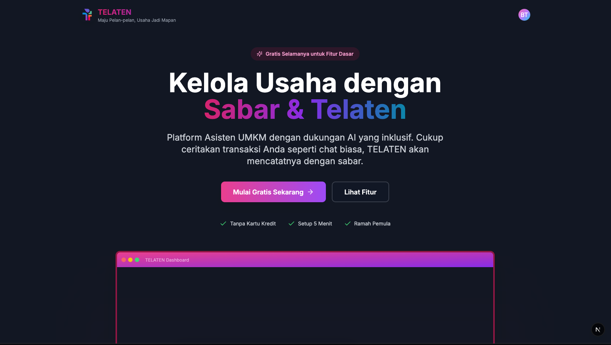
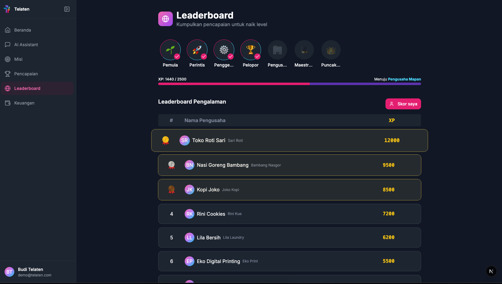

# Telaten Apps

Monorepo for Telaten applications (Backend, Client/Frontend, and API Docs).

## 📂 Repository Structure

- **telaten-backend**: Backend service (Python/FastAPI).
- **telaten-client**: Frontend application (Next.js).
- **telaten-docs-api**: API Documentation (Bruno Collection).

## 🚀 Cloning the Repository (IMPORTANT)

Since this repository uses **Git Submodules**, you must clone it in a specific way to ensure all folders are populated.

### Option 1: Fresh Clone

Use the `--recurse-submodules` flag when cloning:

```bash
git clone --recurse-submodules https://github.com/username/telaten-apps.git
cd telaten-apps
```

### Option 2: If already cloned normally

If the submodule folders are empty, run the following command in the project root:

```bash
git submodule update --init --recursive
```

---

## 🛠️ Setup & Running the Application

### 1. Backend (`telaten-backend`)

The backend is built using Python (FastAPI).

**Prerequisites:**

- Python >= 3.12
- PostgreSQL (Ensure the database is running)

**Steps:**

1. Navigate to the backend directory:

   ```bash
   cd telaten-backend
   ```

2. Create the `.env` file:

   ```bash
   cp .env.example .env
   ```

   _Adjust the configuration in `.env` (especially `DATABASE_URL` and `SECRET_KEY`)._

3. Install dependencies:
   Using `uv` is recommended (as `uv.lock` is present), but `pip` works as well.

   **Using uv (Recommended):**

   ```bash
   uv sync
   ```

   **Using pip:**

   ```bash
   pip install .
   # Or for editable mode (development)
   pip install -e .
   ```

4. Run the application:

   ```bash
   # If using uv
   uv run python run.py

   # If using standard python/pip
   python run.py
   ```

   The server will run at `http://localhost:8000`.

---

### 2. Frontend (`telaten-client`)

The frontend is built using Next.js.

**Prerequisites:**

- Node.js
- Bun (Recommended, as `bun.lock` is present) or npm

**Steps:**

1. Navigate to the client directory:

   ```bash
   cd telaten-client
   ```

2. Create the `.env.local` file:

   ```bash
   cp .env.example .env.local
   ```

   _Set `NEXT_PUBLIC_API_BASE_URL` to the backend URL (default: `http://localhost:8000/api/v1`)._

3. Install dependencies:

   ```bash
   bun install
   # or
   npm install
   ```

4. Run in development mode:
   ```bash
   bun dev
   # or
   npm run dev
   ```
   The application will run at `http://localhost:3000`.

---

### 3. API Documentation (`telaten-docs-api`)

API documentation is managed using **Bruno**.

1. Install [Bruno](https://www.usebruno.com/).
2. Open Bruno, select **Open Collection**.
3. Navigate to the `telaten-docs-api` folder.
4. You can explore and test the available endpoints (make sure the Environment in Bruno is set to `local`).

## 👀 Preview

### Landing Page



### Leader board



### Demo Doing Task


## 🐳 Docker (Optional)

Docker support is available for the backend.

```bash
cd telaten-backend
docker-compose up -d
```
